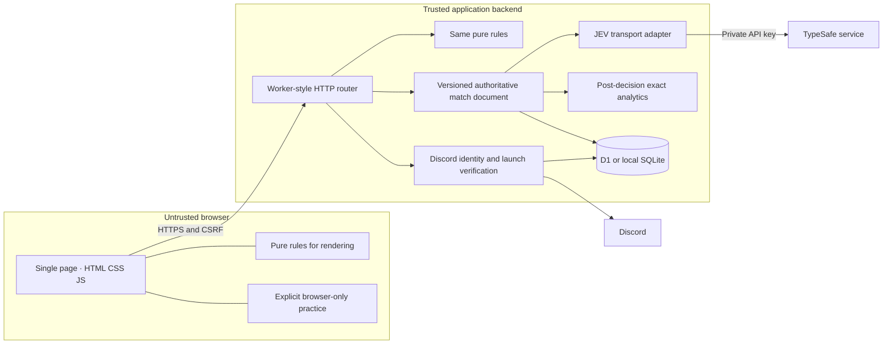
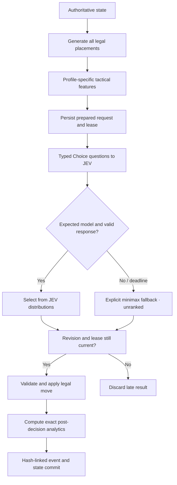
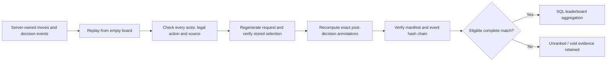

# Architecture

## Runtime and trust boundaries



Browser state is never proof of a result. The backend owns the action history, opponent request, selection, source labels and eligibility. The browser receives exact postgame annotations only after a match closes. Authenticated users own their matches across sessions; guests own only their current server session's matches.

The same backend router runs in Cloudflare Workers or the native Node development server. The latter provides a D1-shaped binding over actual built-in SQLite. There is no runtime web framework, ORM, arbitrary AI proxy, web socket, or separate task service.

## Decision loop



One legal move is labeled `forced` and avoids a model call. The default budget is three seconds total with at most two transient transport attempts. Valid low-confidence responses and malformed structured responses are not rerolled. Provider responses must exactly match the pinned model and legal options.

A decision lease lasts fifteen seconds, longer than the model budget. Recovery of an abandoned prepared request uses a labeled deterministic fallback and invalidates ranked eligibility. It does not silently repeat potentially completed inference. A stale response cannot apply a second move.

## Authentication and attribution

```mermaid
sequenceDiagram
  participant B as Browser
  participant W as Backend
  participant D as Discord
  B->>W: Begin OAuth login
  W->>W: Persist one-time state and pending launch hash
  W-->>B: Discord authorize redirect · identify only
  B->>D: User grants identity permission
  D-->>B: Authorization code and state
  B->>W: OAuth callback
  W->>W: Validate and consume state
  W->>D: Exchange code; read identity
  W->>W: Rotate opaque session; discard provider tokens
  W-->>B: HttpOnly application session
  B->>W: CSRF-protected context redemption
  W->>W: Match OAuth user to signed interaction's user
  W-->>B: Short-lived verified channel and guild grant
```

OAuth alone does not establish a channel. `/play tic-tac-toe` must arrive as a valid signed guild interaction. An opaque launch code is bound to its invoking Discord user and can be redeemed by that user's authenticated session only.

## Initial match on page load

`public/game/boot.js` resolves the player's starting match; `public/app.js` drives it. The sequence is: read `/api/me`; if it names an `activeMatchId`, load that match and, when `expiresAt` has passed, `POST .../resume` it; only an absent (404/400), ended or just-expired prior match is replaced by `POST /api/matches`. The create body (and its `requestId`) is held across retries, so an ambiguous failure replays idempotently, and an `active_match_exists` reply adopts the existing match. Any connection or server failure leaves the page in a visible error state with Retry; it never starts local practice on its own and never replaces the match already on screen. Local practice is an explicit choice offered only when no match is shown. Concurrent runs in one page share a single flight, and tabs of one browser are serialised with a Web Lock so the second sees the first's match. The server alone does not dedupe two simultaneous casual creates from one session (its unique index covers ranked matches only), which is why the client serialises.

## Result verification



The verifier also binds duplicated decision data to its event and binds completion metadata to the completion event. It never fetches a new response to replay a game.

## Storage

The six tables are `users`, `sessions`, `launches`, `matches`, `quotas`, and `operational_counters`. The latter two are the small additions required for request-budget safety and extensive operational analytics.

Tic-Tac-Toe has at most nine placements, so a single bounded JSON match document holds the moves, decision evidence, receipts and event chain. Indexed scalar columns support ownership, active-match restrictions, expiry, history and leaderboard queries. Updating a match uses a conditional `WHERE revision = expected` statement; state and associated events are committed together. No separate leaderboard cache/table can drift from accepted results.

## Leaderboards

Scopes: world; verified guild; verified channel. Official cohorts: configuration hash and human X/O mark. Score: `(wins + 0.5*draws)/games`. Twenty games are required for a ranked position. Equal rates share a dense rank; below-threshold entries are explicitly provisional. Ordering within an equal-rate group uses the public player ID only for stable pagination.

A ranked match commits when created. Fifteen-minute abandonment on a human turn counts as a loss; an expired service-pending turn is void. Restarting an active match requires resumption or resignation. A fallback anywhere in a match removes official eligibility. The system cannot prove that the human avoided external assistance.

## Deliberate simplifications

No React, bundler, runtime SDK dependency, bot gateway, Redis, event streaming, account federation layer, generic plugin system, Elo, monetary prizes, public replay hosting, automated Discord posting, or arbitrary browser-to-model endpoint. Browser-only practice is untrusted and does not later become an official match.
